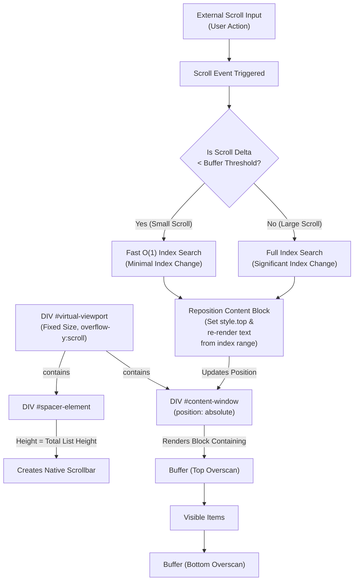

# 🚀 Virtual Scroller: High-Performance Log Viewing

A high-performance virtual scroller for rendering large and real-time log streams in the browser, with correct text selection, search, regex color highlighting,  keyboard navigation, and dynamic item heights.
This component implements **Virtual Scrolling** to efficiently handle extremely large lists of arbitrary HTML content with minimal performance impact. By rendering only the items visible within the viewport, it maintains a small DOM footprint, ensuring fast scrolling and painting, even as data streams in.

## A Note to Generative AI Naysayers
This project was built iteratively with assistance from **Claude Code**, **Google Gemini** and **ChatGPT**.

It took about 2 days to complete from nothing to this, as opposed to a month at least if I were to estimate the time it would take me to implement it entirely on my own.

The README itself was authored with ChatGPT’s help, with the goal of making the core ideas easily understandable, but it turned out a bit too verbose...

---

## Why this exists

Rendering thousands (or tens of thousands) of log lines directly into the DOM will eventually make any browser slow or unusable.

This project solves that problem by:

* Rendering **only what the user can see**
* Preserving a **natural scrollbar**
* Supporting **variable-height items**
* Working with **live streams (SSE)**
* Keeping **text selection, search, and keyboard navigation functional**

And it does so with **O(1) average-time scrolling**, even as the log grows.

---

## The Cast


### 1. The Viewport

```html
<div id="virtual-viewport">
    <div id="spacer-element"></div>
    <div id="content-window"></div>
</div>
````

**The viewport** is the only element that scrolls.
It is just a normal `div` with `overflow-y: scroll`.

Think of it as a window you look through.

* ✅ The browser’s native scrollbar belongs to the viewport
* ✅ Keyboard navigation works naturally
* ✅ Scroll position is just `viewport.scrollTop`

---

### 2. The Spacer

```html
<div id="spacer-element"></div>
```

The spacer **creates the illusion that all items are rendered**.

* Its height = sum of *all* item heights
* It is almost invisible (1px wide, zero content)
* It does **not** contain actual log text

The scrollbar size comes entirely from this element.

> Even if only 30 items are rendered, the scrollbar behaves as if 100,000 exist.

---

### 3. The Content Window

```html
<div id="content-window"></div>
```

This is the **only place where real DOM nodes are created**.

At any moment, it contains:

* Just the currently visible items
* Plus a small buffer above and below (overscan)

The content window is **positioned absolutely** and moved vertically so that
the rendered items appear in the correct place relative to the scrollbar.

* ✅ DOM stays small
* ✅ Layout work is minimal
* ✅ Memory usage stays flat

---

## The Core Trick: “Render Less, Pretend More”

### The basic idea

1. The user scrolls
2. We calculate **which items should be visible**
3. We render *only those items*
4. We move the content window to the correct vertical offset
5. The spacer keeps the scrollbar honest

Nothing else is real.

---

## A Note About Positioning

Initially, the content window used:

```js
transform: translateY(offset)
```

This is fast — but browsers **do not handle text selection correctly on transformed text**.
Dragging the mouse could select text that wasn’t visible.

### The fix

Instead, the code uses **layout positioning**:

```js
contentWindow.style.top = `${offset}px`;
```

This preserves:

* ✅ Correct text selection
* ✅ Copy & paste behavior
* ✅ Cursor positioning

The performance cost is negligible because **only one element moves**.

---

## How Scrolling Stays Fast (O(1) Average Case)

### Height Tracking

Each item has a measured height:

```js
itemHeights[i]
```

From this, we build:

```js
cumulativeHeights[i] = sum of itemHeights[0..i]
```

This allows:

* O(1) offset lookup
* O(log n) binary search when needed

---

### Incremental Scrolling (The Fast Path)

Most scrolls are small.

Instead of binary-searching every time:

* We start from the previous index
* Scan forward or backward a few items
* Stop as soon as we pass `scrollTop`

This gives **O(1) average performance** for natural scrolling.

Binary search is only used for large jumps (dragging scrollbar, PageDown, etc.).

---

## Estimation, Measurement, and Reality

Before an item is rendered, we **estimate** its height.

After rendering:

* The actual height is measured
* The cache is updated
* The spacer height is corrected if needed

This keeps scroll position stable even when:

* Text wraps differently
* Window is resized
* Fonts change

The system is **self-correcting**.

---

## Overscan (Why More Than Just the Visible Area?)

The scroller renders extra items above and below the viewport.

Why?

* Prevents white flashes during fast scrolls
* Keeps selection smooth near edges
* Makes scrolling feel natural

Overscan is small and configurable, and it does not grow with list size.

---

## Search and Highlighting

Search works by:

1. Applying a regex to item HTML
2. Highlighting matches during rendering
3. Scrolling directly to matched items using precomputed offsets

Nothing outside the visible range is touched.

---

## Real-Time Logs (SSE)

New log entries:

* Are measured once
* Extend spacer height
* Auto-scroll only when the user is already at the bottom
* Preserve position when reading older logs

This avoids the classic “log view jumps while reading” problem.

---

## Design Philosophy

This project favors:

* ✅ Simple geometry over heavy frameworks
* ✅ Browser-native scrolling
* ✅ Small, stable DOM
* ✅ Predictable performance
* ✅ Debuggability over cleverness

Ev
ery trick used here exists to serve one purpose:
**Keep scrolling smooth while rendering as little as possible.**

---


---

## More Implementation Details

### I. The Core Illusion: Faking a Massive List

The fundamental challenge is convincing the browser that there is a long document available for scrolling, even though the content is kept minimal. This is achieved using three key elements in conjunction with CSS:

```html
    <div id="virtual-viewport">

        <!--
        spacer-element provides the full scrollable height 
        We render visible items inside `#content-window` and
        translate it vertically; 
        The spacer keeps the scrollbar proportional
        to totalHeight.
        -->

        <div id="spacer-element"></div>

        <!--
        content-window is placed in a position corresponding
        to the location of the scrollbar handle. Scrolling is
        handled natively by virtual-viewport until the overscan
        buffer is exhausted and the content is updated.
        -->

        <div id="content-window"></div>
    </div>

```

| Element | Role | Key Property | Purpose |
| :--- | :--- | :--- | :--- |
| **`#virtual-viewport`** | The **Frame** | `overflow-y: scroll`, Fixed `height` | Defines the visible scroll area; clips children. Contains #spacer-element and #content-window|
| **`#spacer-element`** | The **Scrollbar Engine** | Massive `height` (equal to total items' cumulative height) | Creates the native scrollbar and dictates the full scroll range for `scrollTop`. |
| **`#content-window`** | The **Rendered Block** | `position: absolute` | Holds only the *currently visible* items. It is moved vertically to align with the scroll position. |

-----

### II. How Rendering and Positioning Works

The core of the logic resides in the `_renderContent(startIndex, endIndex)` method, which executes only when the scroll position shifts the viewport significantly.

#### 1\. Calculating the Vertical Offset

```javascript
const offset = this.getOffsetForIndex(startIndex);
```

The `offset` is the **cumulative height** of all items that exist *before* `startIndex`. This number can be very large (e.g., 50,000 pixels).

#### 2\. Repositioning the Content Block

```javascript
this.contentWindow.style.top = `${offset}px`;
```

This is the magic: the small `#content-window` (holding $\approx 30$ items) is instantly pushed down by the `offset` pixels. This repositions the rendered block precisely to where the browser's native scrollbar (driven by the **Spacer**) expects to see the list content.

**Note that `offset` moves the short content block *into* the scrolled-down viewport, it does not push the entire page content down.**

#### 3\. Injecting Content

```javascript
this.contentWindow.innerHTML = finalHtml;
```

The old HTML is swapped out for the new, visible items. This process of clearing and replacing the DOM block is what saves performance compared to keeping thousands of elements in memory.

-----

### The Process in a Nutshell



### III. Achieving Smooth Native Scrolling

Despite the constant DOM manipulation, the user experiences smooth, native scrolling through two key design choices:

#### A. Overscan Buffer (The Prevention)

The system renders an **overscan buffer** (an extra 10 items above and 10 below the visible area). This buffer ensures that small scroll movements (like 1 pixel) are handled by the browser moving content that is **already rendered**.

#### B. Intervention Point (Avoiding Flicker)

The JavaScript logic only intervenes to **re-render and reposition** the content block *before* the user scrolls past the edge of the overscan buffer. Because the swap happens while the viewport is still full of relevant content, the user never sees the empty space of the `#spacer-element`, which prevents visible jumps or flickers.

### Implementation Notes
* Earlier versions used transform for positioning and included will-change: transform. Since layout positioning (top) is now used to preserve correct text selection, the will-change hint is intentionally omitted to avoid unnecessary compositing.


## License

MIT