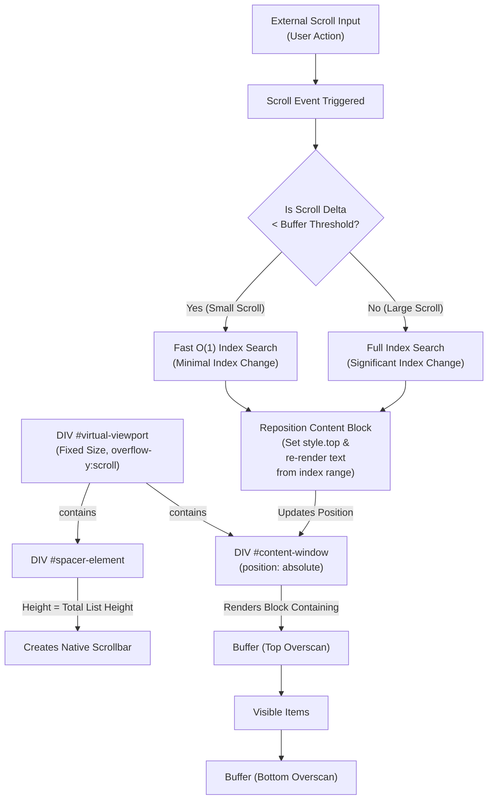

# 🚀 Virtual Scroller: High-Performance Log Viewing

This component implements **Virtual Scrolling** to efficiently handle extremely large lists of arbitrary HTML content with minimal performance impact. By rendering only the items visible within the viewport, it maintains a small DOM footprint, ensuring fast scrolling and painting, even as data streams in.

## I. The Core Illusion: Faking a Massive List

The fundamental challenge is convincing the browser that there is a long document available for scrolling, even though the content is kept minimal. This is achieved using three key elements in conjunction with CSS:

```html
    <div id="virtual-viewport">

        <!--
        spacer-element provides the full scrollable height 
        We render visible items inside `#content-window` and
        translate it vertically; 
        The spacer keeps the scrollbar proportional
        to totalHeight.
        -->

        <div id="spacer-element"></div>

        <!--
        content-window is placed in a position corresponding
        to the location of the scrollbar handle. Scrolling is
        handled natively by virtual-viewport until the overscan
        buffer is exhausted and the content is updated.
        -->

        <div id="content-window"></div>
    </div>

```

| Element | Role | Key Property | Purpose |
| :--- | :--- | :--- | :--- |
| **`#virtual-viewport`** | The **Frame** | `overflow-y: scroll`, Fixed `height` | Defines the visible scroll area; clips children. |
| **`#spacer-element`** | The **Scrollbar Engine** | Massive `height` (equal to total items' cumulative height) | Creates the native scrollbar and dictates the full scroll range for `scrollTop`. |
| **`#content-window`** | The **Rendered Block** | `position: absolute` | Holds only the *currently visible* items. It is moved vertically to align with the scroll position. |

-----

## II. How Rendering and Positioning Works

The core of the logic resides in the `_renderContent(startIndex, endIndex)` method, which executes only when the scroll position shifts the viewport significantly.

### 1\. Calculating the Vertical Offset

```javascript
const offset = this.getOffsetForIndex(startIndex);
```

The `offset` is the **cumulative height** of all items that exist *before* `startIndex`. This number can be very large (e.g., 50,000 pixels).

### 2\. Repositioning the Content Block

```javascript
this.contentWindow.style.top = `${offset}px`;
```

This is the magic: the small `#content-window` (holding $\approx 30$ items) is instantly pushed down by the `offset` pixels. This repositions the rendered block precisely to where the browser's native scrollbar (driven by the **Spacer**) expects to see the list content.

**Note that `offset` moves the short content block *into* the scrolled-down viewport, it does not push the entire page content down.**

### 3\. Injecting Content

```javascript
this.contentWindow.innerHTML = finalHtml;
```

The old HTML is swapped out for the new, visible items. This process of clearing and replacing the DOM block is what saves performance compared to keeping thousands of elements in memory.

-----

## The Process in a Nutshell




## III. Achieving Smooth Native Scrolling

Despite the constant DOM manipulation, the user experiences smooth, native scrolling through two key design choices:

### A. Overscan Buffer (The Prevention)

The system renders an **overscan buffer** (an extra 10 items above and 10 below the visible area). This buffer ensures that small scroll movements (like 1 pixel) are handled by the browser moving content that is **already rendered**.

### B. Intervention Point (Avoiding Flicker)

The JavaScript logic only intervenes to **re-render and reposition** the content block *before* the user scrolls past the edge of the overscan buffer. Because the swap happens while the viewport is still full of relevant content, the user never sees the empty space of the `#spacer-element`, which prevents visible jumps or flickers.

